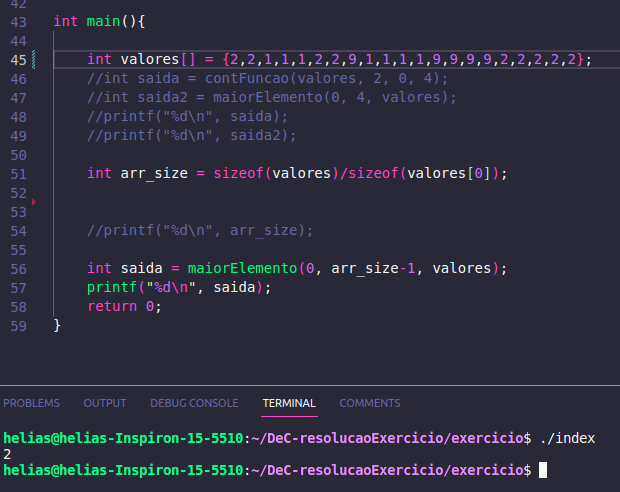
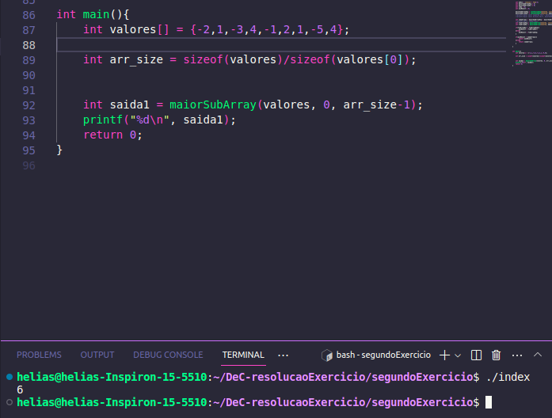

# Resolução de exercícios

**Número da Lista**: 4 
**Conteúdo da Disciplina**: Dividir e Conquistar 

## Alunos
|Matrícula | Aluno |
| -- | -- |
| 14/0158278  |  Pedro Helias Carlos |
| 17/0069991	 |  João Victor Max Bisinotti de Oliveira |

## Sobre 
Resoluçaõ de exerícios: Maior frequência numero, MergeSort(a fazer)

## Screenshots
Exercicio 1

Exercicio 2

## Instalação 
**Linguagem**: .C 

Descreva os pré-requisitos para rodar o seu projeto e os comandos necessários:
- Compilar o arquivo .C utilizando "gcc arquivo.c -o arquivo"
- rodar utilizando "./arquivo"

## Uso 
O exercício 169 reflete um <a href="https://leetcode.com/problems/majority-element/description/">problema</a> encontrado no LeetCode, sobre a frequência de aparecimento de um certo valor numa lista de valores aleatórios não ordenados, sendo esse último ponto não obrigatório. É possível realizar esse procedimento de diversas formas, porém sem a garantia da menor complexidade. Utilizamos Dividir e Conquistar para construir o algoritmo. Então, ele vai fazendo divisões subsequêntes, de forma recursiva, até no fim dividir a lista e contar a frequência de cada valor. 

O exercício 53 reflete um <a href="https://leetcode.com/problems/maximum-subarray/description/">problema</a> encontrado no LeetCode, sobre um máximo subArray, vindo de um array maior. O objetivo do problema é encontrar a soma do maior subArray possível dentro do vetor. A solução para o problema foi utilizar Dividir e Conquistar novamente, realizando as divisões entre a estrutura do vetor. A cada subdivisão(partindo de uma resoluçaõ com recursividade), verifica-se a soma dos subArrays. Por fim, compara-se os valores obtidos pelas operações e retornam o valor mais alto. 